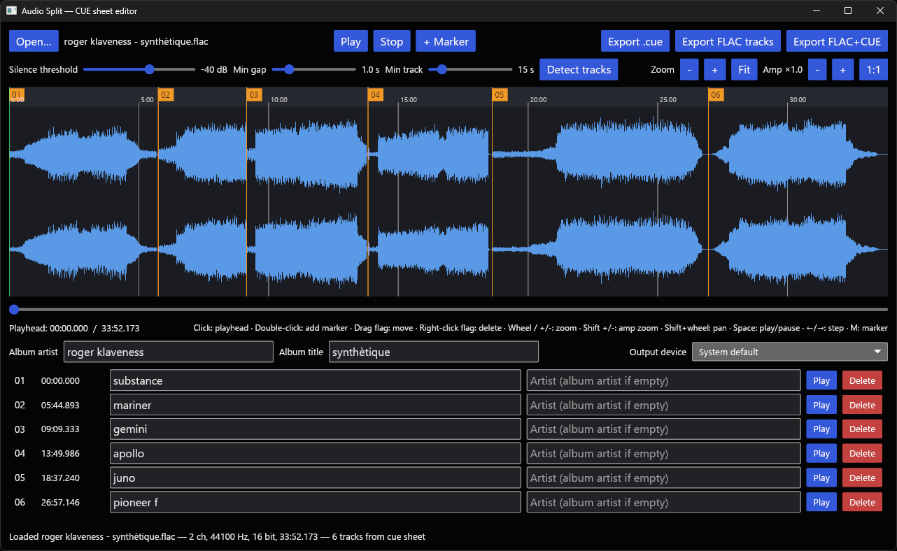

# audio-split

A small desktop tool for turning a single continuous audio recording 
(vinyl rip, live set, tape transfer, …) into a CUE sheet or individual 
tagged FLAC tracks.

Built in Rust with [iced](https://iced.rs). 
Should run on Linux, Windows and macOS.

## Features

- Loads WAV and FLAC files (stereo or mono).
- Loads `.cue` files to resume editing: the referenced audio file is opened
  and markers, track metadata and album metadata are restored. Placeholder
  titles ("Track 01", …) are treated as empty, as is a track artist equal
  to the album artist.
- Automatic gap detection: finds silent stretches between tracks, with
  adjustable silence threshold (dB), minimum gap length and minimum track
  length.
- Waveform view with smooth zoom (mouse wheel, anchored at the cursor) and
  panning (shift + wheel, horizontal scroll, or the scrollbar under the
  waveform).
- Selectable audio output device (defaults to the system device).
- Track markers shown as numbered flags in the timeline strip above the
  waveform: drag a flag to move it, right-click to delete, double-click the
  waveform (or press `M`, or use the **+ Marker** button) to add one.
- Playback from any position to audition marker placement — click the
  waveform to place the playhead, space to play/pause, ←/→ to seek, 
  or the per-track **Play** button to audition a track start.
- Editable track list with per-track title and artist, plus album-level
  artist and title.
- Export:
  - a `.cue` sheet referencing the loaded audio file,
  - one FLAC file per track, tagged with track number, title, artist,
    album and album artist, or
  - a single FLAC of the whole recording with the cue sheet embedded as a
    `CUESHEET` vorbis comment (understood by foobar2000, DeaDBeeF, kodi, …)
    plus album tags.

## Keyboard & mouse

| Action | Binding |
| --- | --- |
| Play / pause | `Space` |
| Step playhead ±5 % of the visible span | `←` / `→` |
| Add marker at playhead | `M` |
| Set playhead | click waveform |
| Add marker | double-click waveform |
| Move marker | drag its flag in the top strip |
| Delete marker | right-click its flag (or the list's Delete button) |
| Zoom | mouse wheel over the waveform, or `+` / `-` |
| Amplitude (vertical) zoom | `Shift` + `+` / `-`, or the Amp buttons (1:1 resets) |
| Pan | shift + wheel, horizontal scroll, or the scrollbar |

## Screenshot



## Download release

Download the latest release for your operating system from the release page.

### Security issues

Since the executable is not signed, it may be flagged on mac and windows.

**Mac users** need to move the download to the Application folder and 
disable the quarantine. Open a terminal and execute this line: 
```sh
xattr -d com.apple.quarantine /Applications/AudioSplit.app 
```

[Video: Download and install on macOS](https://github.com/user-attachments/assets/1dce08b9-07c5-46b5-ab77-72787adac3b8)

**Windows users** should extract the zip file and run the exe file inside it. You **may** get a Microsoft Defender warning about an unrecognized app, if so, click **More info** and **Run anyway** 

If you get an error with 'VCRUNTIME140.dll was not found', install this

[Visual C++ v14 Redistributable](https://aka.ms/vc14/vc_redist.x64.exe)

[Video: Download and run on Windows](https://github.com/user-attachments/assets/01b01071-1682-4a55-8352-8ef77e6f6735)

## Building

```sh
cargo build --release
```

The binary ends up in `target/release/audio-split`.

### Linux prerequisites

```sh
sudo apt install libasound2-dev pkg-config   # Debian/Ubuntu
```

(ALSA headers for audio playback. Fedora: `alsa-lib-devel`.)

### Windows cross-build

Windows cross-build from Linux (needs `mingw-w64` installed; linker configured in `.cargo/config.toml`):

```sh
cargo build --release --target x86_64-pc-windows-gnu
# → target/x86_64-pc-windows-gnu/release/audio-split.exe
```

## Notes

- The whole file is decoded into memory (32-bit float): roughly 20 MB per
  stereo minute at 44.1 kHz, so an hour-long recording uses ≈ 1.2 GB.
- "Detect tracks" replaces the current marker list.
- FLAC export writes at the source bit depth (clamped to 16–24 bit).
- The CUE sheet uses one `FILE … WAVE` entry with `INDEX 01` per track,
  which is what most players and rippers expect.

## Tests

`cargo test` runs an end-to-end test that synthesizes a WAV with three
tones separated by silence, then verifies gap detection, CUE output and
FLAC export (lengths and tags) by decoding the results again.
